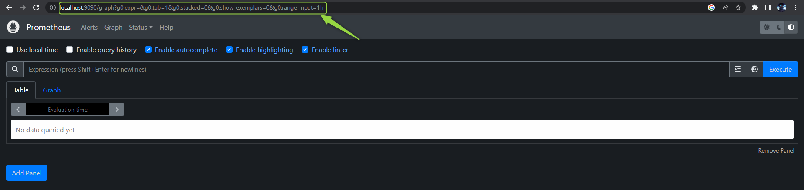

Reference: https://jhooq.com/prometheous-k8s-aws-setup/

# Prometheous - Grafana - EKS - Terraform
## Step 1 | Setup infrastructure

Follow the README.md file in the webapp-terraform directory:

    cd webapp-terraform

## Step 2 | Install K8S Metrics Server

Install the Kubernetes Metrics server onto the Kubernetes cluster so that Prometheus can collect the performance metrics of Kubernetes. 

Kubernetes Metrics server collects the resource metrics from kubelets and exposes it to the Kubernetes api server through Metrics API for use by Horizontal Pod Autoscaler and Vertical Pod Autoscaler.

The Kubernetes metrics offers:
- Fast autoscaling, collecting metrics
- Scalable support up to 5,000 node clusters.
- Resource efficiency and it requires very less cpu(1 mili core) and less memory(2 mb)

Use the command below

    kubectl apply -f https://github.com/kubernetes-sigs/metrics-server/releases/latest/download/components.yaml

Result:

You can verify the Kubernetes metric server installation:
    
    kubectl get deployment metrics-server -n kube-system 
    
or you can use

    kubectl get pods -n kube-system

## Step 3 | Install Prometheus

Add Prometheus helm chart repository

    helm repo add prometheus-community https://prometheus-community.github.io/helm-charts 

Make sure to update all the charts

    helm repo update 

Create **namespace** and install, therefore, see the result:

    kubectl create namespace prometheus

    helm install prometheus prometheus-community/prometheus \
    --namespace prometheus \
    --set alertmanager.persistentVolume.storageClass="gp2" \
    --set server.persistentVolume.storageClass="gp2" 

You can access by using 'port-forward' command

    kubectl port-forward deployment/prometheus-server 9090:9090 -n prometheus

## Step 4 | Install Grafana

Add the Grafana helm chart repository

    helm repo add grafana https://grafana.github.io/helm-charts 

Make sure to update all the charts

    helm repo update 

Create a Prometheus data source so that Grafana can access the Kubernetes metrics. 
Therefore, create a yaml file **grafana.yaml** and save the following data source configuration into it

    datasources:
      datasources.yaml:
        apiVersion: 1
        datasources:
        - name: Prometheus
        type: prometheus
        url: http://prometheus-server.prometheus.svc.cluster.local
        access: proxy
        isDefault: true

Create a namespace grafana and then install

    kubectl create namespace grafana

    helm install grafana grafana/grafana \
        --namespace grafana \
        --set persistence.storageClassName="gp2" \
        --set persistence.enabled=true \
        --set adminPassword='abc' \
        --values grafana.yaml \
        --set service.type=LoadBalancer 

#### [NOTE] Here I set the adminPassword for Grafana account is ***'abc'***, you can change it if you want, yet make sure that the adminPassword you input must be a **'string'** value

Verify your installation

    kubectl get all -n grafana

To Access the Grafana dashboard we need to find Public AWS IP address and for that use the following command

    kubectl get service -n grafana 

## And then, simply witness your result!

