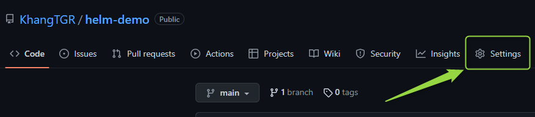
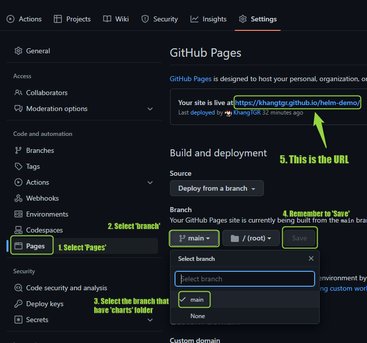

Refference: https://www.opcito.com/blogs/creating-helm-repository-using-github-pages

# Helm chart repo on GitHub instructions
## Step 0 [OPTIONAL] | Config the image values of chart files
Run the command below:

    sh helm-image-edit.sh

Then it would display like theses lines

    ==========================================
    Enter your Docker account name: khangtgr
    Enter your image repo name: webapp
    Enter your image tag: v1
    ==========================================
    File values.yaml edited successfully

## Step 1 | Prepare a 'charts' folder that contains all the chart files
In this tutorial, I chose 'webapp-helm' chart which I already have. 

    charts/
    └── webapp-helm
        ├── Chart.yaml
        ├── templates
        │   ├── deployment.yaml
        │   ├── _helpers.tpl
        │   ├── NOTES.txt
        │   └── service.yaml
        └── values.yaml

To make sure that the charts run without flaws. Use command:

    helm lint charts/webapp-helm

If it show like in the below, then it runs.

    ==> Linting charts/webapp-helm
    [INFO] Chart.yaml: icon is recommended

    1 chart(s) linted, 0 chart(s) failed

Next, this is an ***optional*** choice, add robots.txt at the root location of the repository. This will avoid bot crawling on the Helm repository. 

    echo -e “User-Agent: *\nDisallow: /” > robots.txt 

Finally, package the chart files to a tar. Get to the repository directory to run this command:

    helm package charts/webapp-helm

## Step 2 | Create an URL for GitHub repository
Follow the instructions in the pictures below:

After having the URL, create the index.yaml file for the Helm repository.

    helm repo index --url https://khangtgr.github.io/helm-demo/webapp-helm/ . 

The 'index.yaml' would look like this:

    apiVersion: v1
    entries:
    webapp-helm:
    - apiVersion: v2
        appVersion: 1.0.0
        created: "2022-12-30T14:53:45.507313643+07:00"
        description: A Helm chart for Kubernetes
        digest: d983302be17b0cfa1111c4b8f0d607b41ba307690b7e8c860e4722a15b722078
        name: webapp-helm
        type: application
        urls:
        - https://khangtgr.github.io/helm-demo/webapp-helm/webapp-helm-0.0.1.tgz
        version: 0.0.1
    generated: "2022-12-30T14:53:45.500868175+07:00"

Finally, **push** and **commit** everything onto repository

## Step 3 | Install the chart repo for usage
Add the repo first.

    helm repo add myrepo https://khangtgr.github.io/helm-demo/webapp-helm

To see the result, use these commands:

    helm repo list
    helm search repo myrepo

Ultimately, install the charts

    helm install myrelease myrepo/webapp-helm 

# Have fun and good luck!