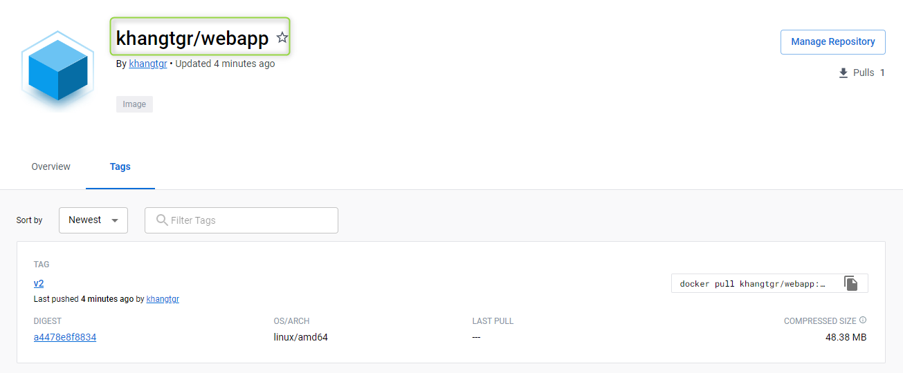

# Setup Docker image for instructions
## Step 1 | Setup AWS credentials
First thing first, run the bash script as below:

    sh credentials-setup.sh

It would appear this this, you simply enter the credentials

    +=====================================================+
    |         Please enter your AWS credentials           |
    +=====================================================+
    - AWS Access Key ID:            ....
    - AWS Secret Access Key:        ....
    - AWS Region:                   ....

## Step 2 | Build & Push image onto DockerHub
Simply follow the script **docker-setup.sh**

    sh docker-setup.sh

And it would display like this:

    Do you want to login your DockerHub account?
            Answer either 'yes' or 'no': no
    ==========================================
    Enter your Docker account name: khangtgr
    Enter your image repo name: webapp
    Enter your image tag: v1
    ==========================================

Then wait a little bit, the image would be pushed successfully afterward.

### NOTE:
After runing **docker-setup.sh**, the file ***.env*** will be deleted for security. Therefore, you will have to run **credentials-setup.sh** again if you want to push image.